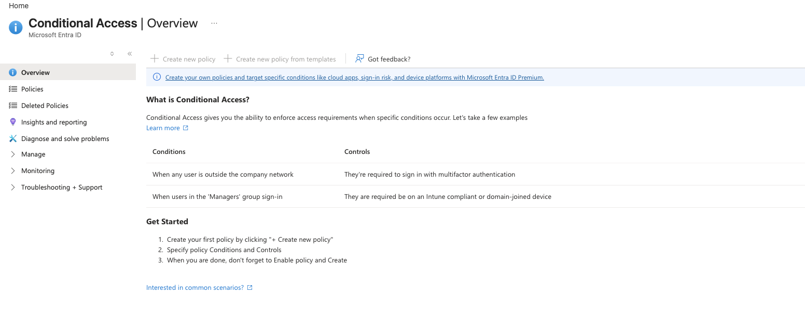
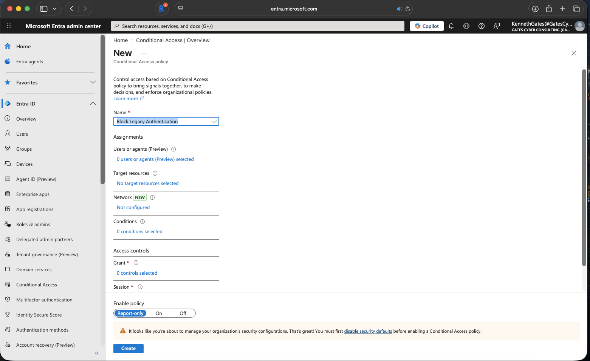
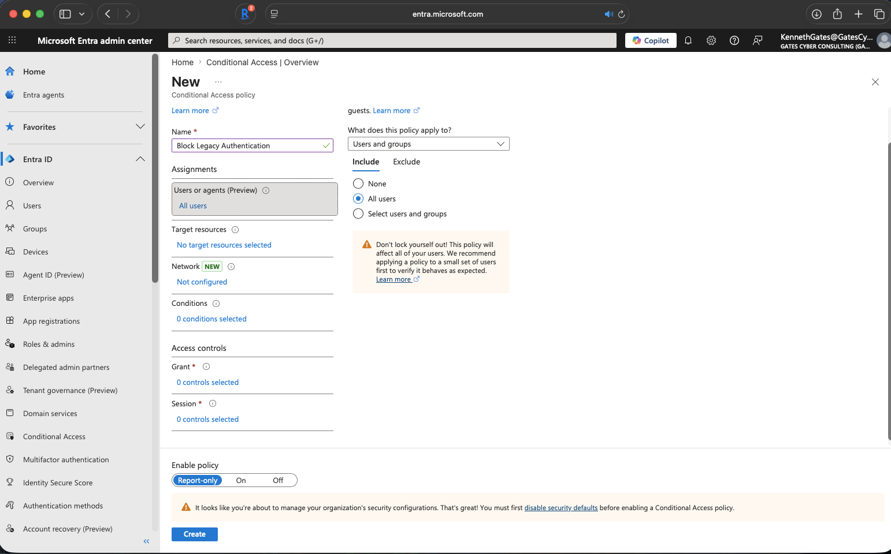
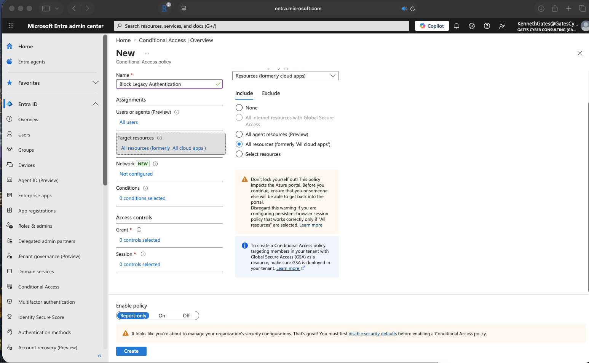
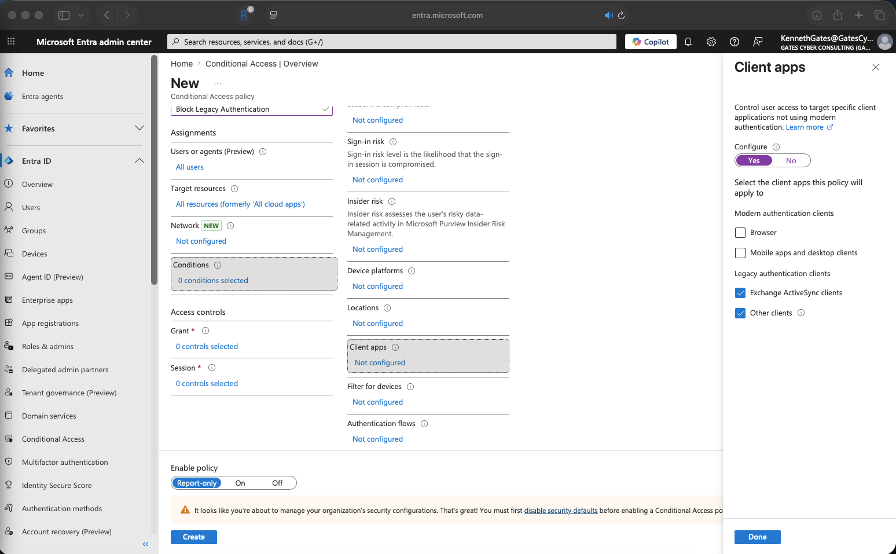
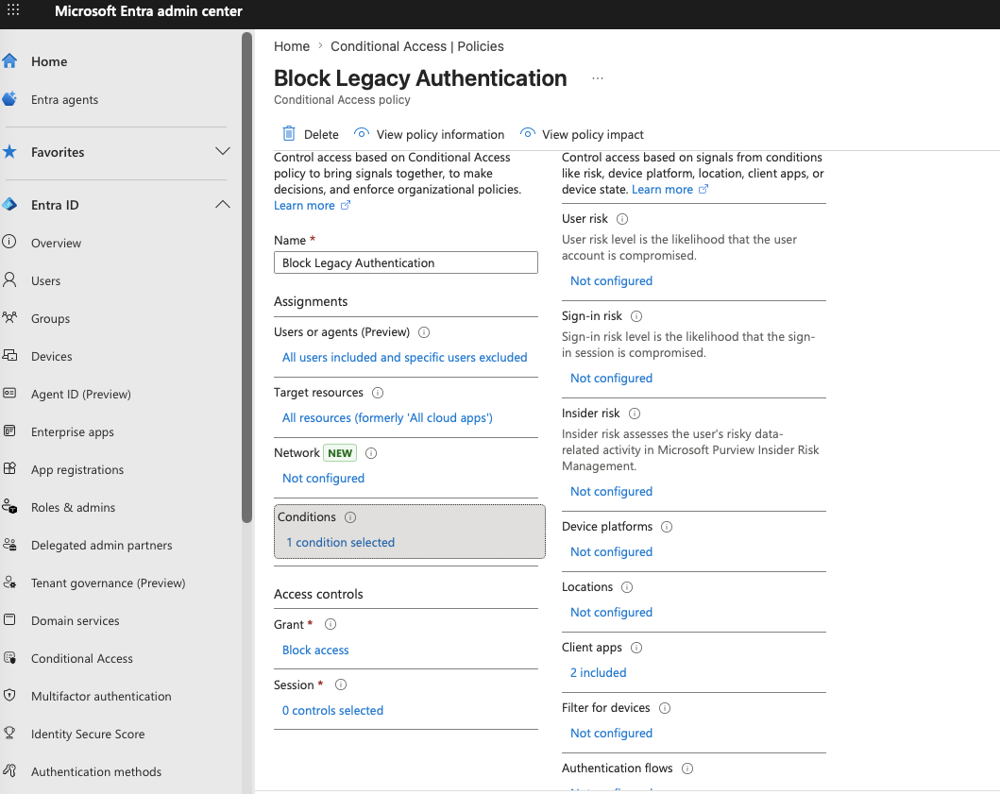
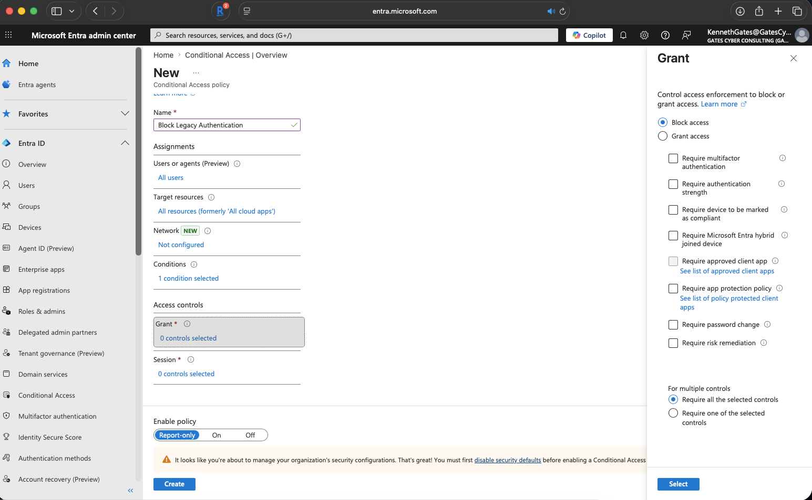
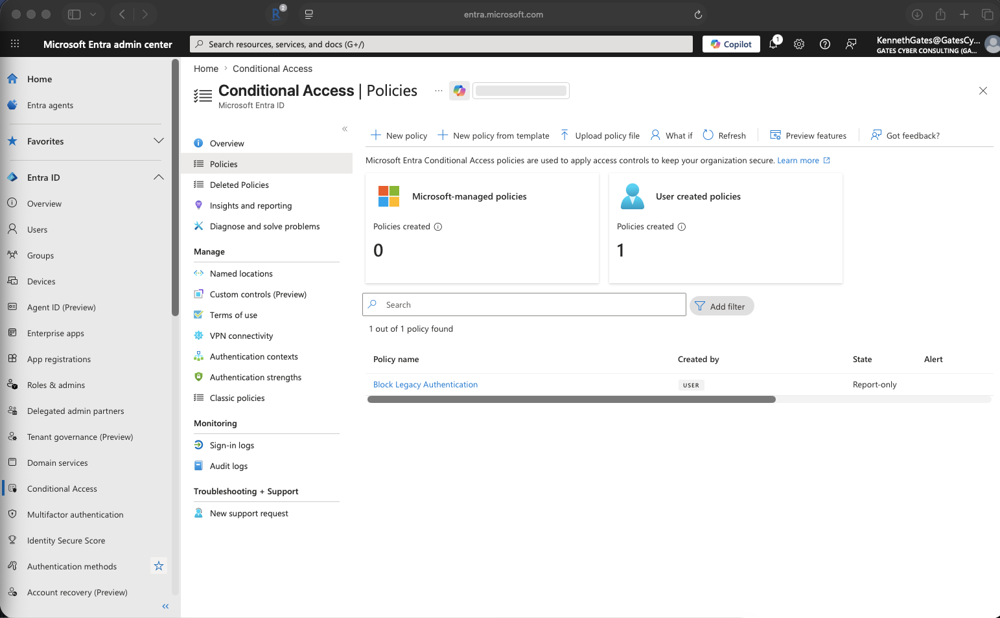
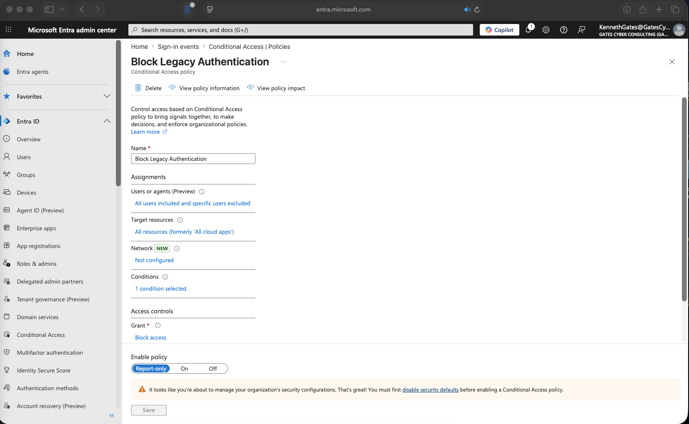

# azure-iam-conditional-access-lab
Azure IAM Conditional Access lab implementing Zero Trust by blocking legacy authentication and analyzing sign-in logs.

## Policy 1 — Block Legacy Authentication

### Overview
Legacy authentication protocols (Exchange ActiveSync, SMTP, IMAP, POP3, and
older Office clients) do not support modern authentication and cannot be
challenged with MFA. This makes any account using legacy auth vulnerable to
credential stuffing and password spray attacks regardless of MFA configuration.

This policy targets and blocks all legacy authentication client types at the
tenant level, applied to all users across all cloud resources.

---

### 📸 Screenshots

**Step 1: Navigate to Conditional Access Overview in Microsoft Entra ID**

**Step 2: Create new policy — name set to "Block Legacy Authentication", Report-only enabled**

**Step 3: Configure Users assignment — All users selected**

**Step 4: Configure Target resources — All resources selected**

**Step 5: Configure Client apps condition — Exchange ActiveSync and Other clients checked**

**Step 6: Configure Grant control — Block access selected, 1 condition confirmed**

**Step 7: Policy saved — Block Legacy Authentication visible in policies list, Report-only state**

**Step 8: Completed policy detail view — full configuration confirmed**
- Users: All users included, specific users excluded
- Target resources: All resources
- Conditions: 1 condition selected (Client apps: 2 included)
- Grant: Block access
- State: Report-only

**Step 9: Policy evaluated against sign-in events — verification evidence**

---

### Policy Configuration

| Setting | Value |
|---|---|
| Policy name | Block Legacy Authentication |
| Users | All users (specific users excluded) |
| Target resources | All resources (formerly All cloud apps) |
| Conditions — Client apps | Exchange ActiveSync clients, Other clients |
| Grant | Block access |
| Policy state | Report-only |

---

### Issue
Legacy authentication protocols in the tenant were not explicitly blocked,
leaving accounts exposed to credential attacks that bypass MFA entirely.
Legacy auth clients cannot respond to MFA challenges, meaning any account
accessible via legacy auth is protected by password alone.

### Resolution
Created a Conditional Access policy targeting all legacy authentication
client types — Exchange ActiveSync clients and Other clients — and configured
the grant control to block access. Policy was deployed in Report-only mode
first to assess tenant impact before enforcement. Policy evaluation was
verified through the Entra ID sign-in events log.

### Result
Policy is active in Report-only state and confirmed to be evaluated against
sign-in events in the tenant. Sign-in logs will capture any legacy auth
attempts with the policy evaluation result recorded, enabling full impact
assessment before switching to Enforce mode.

---

### 🔒 Security Considerations

**Why Report-only first — always**
Enabling this policy directly in Enforce mode without auditing first is
a common mistake that breaks service accounts, shared mailboxes, and legacy
line-of-business applications still using basic authentication. Report-only
mode lets you review the sign-in logs to identify exactly what would have
been blocked before committing to enforcement.

**What "Other clients" covers**
The "Other clients" checkbox targets any application using basic
authentication outside of Exchange ActiveSync — this includes older
versions of Outlook, mail clients using SMTP AUTH, and custom applications
using basic auth against Microsoft APIs. Leaving this unchecked leaves
a significant legacy auth attack surface open.

**Why specific users are excluded**
The policy is scoped to all users with specific exclusions applied. In
production, exclusions should cover break-glass emergency access accounts
only. Break-glass accounts must be cloud-only, excluded from all Conditional
Access policies, and monitored with alerts on any sign-in activity. If
the policy misconfigures and blocks all access, a break-glass account
provides the only recovery path.

**This policy alone does not block all attack paths**
Blocking legacy auth removes one significant attack vector but does not
replace MFA enforcement, sign-in risk policies, or compliant device
requirements. It is the first layer in a defense-in-depth Conditional
Access architecture — each subsequent policy adds a control that the
others cannot provide alone.

---

### What This Demonstrates
- Conditional Access policy creation and configuration in Microsoft Entra ID
- Client apps condition targeting for legacy authentication protocols
- Report-only deployment lifecycle — assess before enforce
- Policy verification through Entra ID sign-in events
- Understanding of legacy authentication as an MFA bypass vector
- Defense-in-depth thinking applied to Zero Trust policy design
