# Azure IAM Conditional Access Lab
Azure IAM Conditional Access lab implementing Zero Trust by blocking legacy authentication and analyzing sign-in logs.

---

## 🧭 Zero Trust Architecture Diagram

---

## 🔐 Policy 1 — Block Legacy Authentication

### 📌 Overview
Legacy authentication protocols (Exchange ActiveSync, SMTP, IMAP, POP3, and older Office clients) do not support modern authentication and cannot enforce MFA.

This makes them highly vulnerable to:
- Password spray attacks
- Credential stuffing
- Brute-force login attempts

This policy blocks all legacy authentication across the tenant using Conditional Access.

---

## ⚙️ Configuration Steps

1. Navigate to **Microsoft Entra ID → Conditional Access**
2. Click **New Policy**
3. Name the policy: `Block Legacy Authentication`
4. Set **Users** → All users
5. Set **Target Resources** → All resources
6. Configure **Client Apps**
   - Enable condition
   - Select:
     - Exchange ActiveSync clients
     - Other clients
7. Configure **Grant Controls**
   - Select **Block Access**
8. Set policy state to:
   - Report-only (testing phase)
9. Click **Create**

---

## 📸 Screenshots

### Step 1: Conditional Access Overview

### Step 2: Create New Policy

### Step 3: Assign Users (All Users)

### Step 4: Target Resources (All Resources)

### Step 5: Configure Client Apps (Legacy Auth)

### Step 6: Configure Grant Control (Block Access)

### Step 7: Policy Created (Report-Only)

### Step 8: Policy Details View

### Step 9: Policy Verification / Sign-in Logs

---

## 🔄 Before vs After

**Before:**
- Legacy auth protocols allowed tenant-wide
- Accounts accessible via EAS/SMTP/IMAP protected by password alone
- MFA could be silently bypassed by falling back to a legacy client

**After:**
- All legacy auth client types blocked at the Conditional Access layer
- Authentication via non-modern clients rejected before credentials are evaluated
- MFA bypass vector eliminated across the tenant

---

## 🔍 Security Impact
Legacy authentication protocols cannot respond to MFA challenges, meaning
any account accessible via legacy auth is protected by password alone —
regardless of whether MFA is configured tenant-wide. Blocking these
protocols eliminates a primary attack vector for password spray and
credential stuffing attacks, enforces consistent authentication standards
across the tenant, and ensures no user can silently bypass MFA by
falling back to a legacy client.

---

### 🧪 Real-World Scenario
An attacker attempts a password spray attack using legacy protocols such as IMAP or SMTP, which do not support MFA. Without this policy, the attacker could successfully authenticate using only a valid password. With this policy in place, the authentication attempt is blocked entirely, preventing unauthorized access.

---

## 🧠 Key Skills Demonstrated

- Azure / Microsoft Entra ID
- Conditional Access Policies
- Identity Security (IAM)
- Zero Trust Architecture
- Security Monitoring & Logging

---

## 🚀 Future Improvements

- Enable policy (move from Report-only → On)
- Integrate with SIEM (Microsoft Sentinel)
- Add MFA enforcement policy
- Monitor risky sign-ins and alerts

---

## 👨🏾‍💻 Author
Kenneth Gates
Cybersecurity | IAM | Cloud Security

---

## 🔐 Policy 2 — Require MFA for All Users

### 📌 Overview
This policy enforces multifactor authentication for all users across all cloud resources in the tenant. A break-glass account is excluded to ensure emergency administrative access is never locked out.

Without MFA enforcement, accounts protected by password alone are vulnerable to:
- Credential stuffing
- Phishing attacks
- Brute-force login attempts

---

## ⚙️ Configuration Steps

1. Navigate to **Microsoft Entra ID → Conditional Access**
2. Click **New Policy**
3. Name the policy: `Require MFA — All Users`
4. Set **Users** → All users
   - Exclude: break-glass admin account
5. Set **Target Resources** → All resources
6. Configure **Grant Controls**
   - Select **Grant access**
   - Check **Require multifactor authentication**
7. Set policy state to **Report-only**
8. Click **Create**

---

## 📸 Screenshots

### Step 1: CA Policies List (Before)

### Step 2: Policy Name Entered

### Step 3: Users — All Users Selected (Include)

### Step 4: Break-Glass Account Excluded

### Step 5: Target Resources — All Resources

### Step 6: Grant — Require MFA Selected

### Step 7: Report-Only Confirmed Before Save

### Step 8: Policy Created — Report-Only in List

### Step 9: Sign-In Logs — Policy Evaluated

---

## 🔄 Before vs After

**Before:**
- No MFA requirement enforced at the Conditional Access layer
- Users could authenticate with password alone across all cloud apps
- Phishing or credential theft provided immediate full account access

**After:**
- All users required to complete MFA for every cloud resource
- Break-glass account excluded to preserve emergency admin access
- Policy evaluated in Report-only mode to validate scope before enforcement

---

## 🔍 Security Impact

Passwords alone are insufficient against modern credential attacks. This policy closes the gap by requiring a second factor at the Conditional Access layer — independent of per-user MFA settings. The break-glass exclusion follows Microsoft's recommended best practice to ensure administrators retain emergency access if MFA infrastructure fails or a misconfiguration affects enforcement.

---

### 🧪 Real-World Scenario

An attacker obtains valid credentials through a phishing campaign. Without MFA enforcement, they authenticate successfully and access cloud resources immediately. With this policy in place, authentication is blocked at the Conditional Access layer until a second factor is verified — rendering stolen credentials alone insufficient for access.

---

## 🧠 Key Skills Demonstrated
- Microsoft Entra ID Conditional Access
- MFA Policy Design
- Break-Glass Account Strategy
- Zero Trust Identity Enforcement
- Report-Only Mode Validation

---

## 👨🏾‍💻 Author
Kenneth Gates  
Cybersecurity | IAM | Cloud Security

---

## 🔐 Policy 3 — Require MFA for Medium & High Risk Sign-Ins

### 📌 Overview
This policy enforces multifactor authentication specifically when Entra ID detects a medium or high risk sign-in. Unlike Policy 2 which requires MFA for all sign-ins, this policy is risk-based — it triggers only when real-time risk signals indicate the session may be compromised.

Without risk-based MFA enforcement, a compromised session flagged as high risk would still be allowed to proceed uninterrupted. This policy closes that gap.

---

## ⚙️ Configuration Steps

1. Navigate to **Microsoft Entra ID → Conditional Access**
2. Click **New Policy**
3. Name the policy: `Require MFA — Medium & High Risk`
4. Set **Users** → All users
   - Exclude: break-glass admin account
5. Set **Conditions → Sign-in risk**
   - Configure: Yes
   - Select: **High** and **Medium**
6. Configure **Grant Controls**
   - Select **Grant access**
   - Check **Require multifactor authentication**
7. Set policy state to **Report-only**
8. Click **Create**

---

## 📸 Screenshots

### Step 1: Policy Name Entered

### Step 2: Users — All Users Selected (Include)

### Step 3: Break-Glass Account Excluded

### Step 4: Sign-In Risk — High and Medium Selected

### Step 5: Grant — Require MFA Selected

### Step 6: Report-Only Confirmed

### Final: All 3 Policies — Report-Only Confirmed

---

## 🔄 Before vs After

**Before:**
- Risky sign-ins flagged by Entra ID were not automatically challenged
- A session marked high risk could proceed without additional verification
- Risk detections generated alerts but triggered no enforcement action

**After:**
- Medium and high risk sign-ins automatically trigger MFA challenge
- Compromised sessions are interrupted before access is granted
- Risk-based enforcement adds an adaptive layer on top of baseline MFA policy

---

## 🔍 Security Impact

Risk-based Conditional Access uses Microsoft's real-time threat intelligence to evaluate each sign-in. When a session is flagged as medium or high risk — due to signals like impossible travel, anonymous IP, or leaked credentials — this policy intercepts it and requires MFA before access is granted. This is a significant improvement over static MFA policies because it responds dynamically to actual threat signals rather than treating every sign-in the same way.

---

### 🧪 Real-World Scenario

A user's credentials are used in a sign-in attempt from an anonymous IP address flagged by Microsoft threat intelligence. Entra ID scores this as a high risk sign-in. Without this policy, the session proceeds. With this policy in place, the user is immediately challenged for MFA — and if they cannot complete it, access is blocked, containing the potential compromise.

---

## 🧠 Key Skills Demonstrated
- Risk-Based Conditional Access
- Microsoft Entra ID Protection
- Adaptive MFA Enforcement
- Real-Time Sign-In Risk Evaluation
- Zero Trust Policy Layering

---

## 👨🏾‍💻 Author
Kenneth Gates
Cybersecurity | IAM | Cloud Security

---

## 🔐 Policy 4 — Block Access for High Risk Sign-Ins

### 📌 Overview
This policy takes a zero-tolerance approach to high risk sign-ins by blocking access entirely rather than challenging with MFA. When Entra ID detects a high risk sign-in — such as one originating from a known malicious IP or exhibiting impossible travel — this policy denies access outright.

This is the most aggressive of the four policies and represents the final layer of the Zero Trust enforcement stack built in this lab.

---

## ⚙️ Configuration Steps

1. Navigate to **Microsoft Entra ID → Conditional Access**
2. Click **New Policy**
3. Name the policy: `Block Access — High Risk Sign-ins`
4. Set **Users** → All users
   - Exclude: break-glass admin account
5. Set **Target Resources** → All resources
6. Set **Conditions → Sign-in risk**
   - Configure: Yes
   - Select: **High** only
7. Configure **Grant Controls**
   - Select **Block access**
8. Set policy state to **Report-only**
9. Click **Create**

---

## 📸 Screenshots

### Step 1: Policy Name Entered
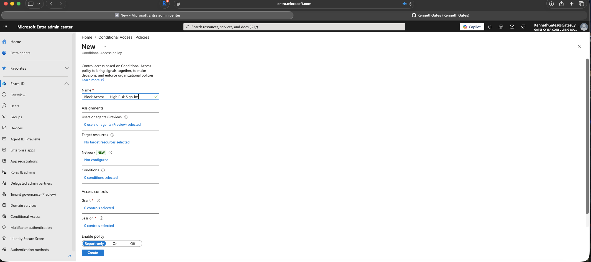

### Step 2: Break-Glass Account Excluded
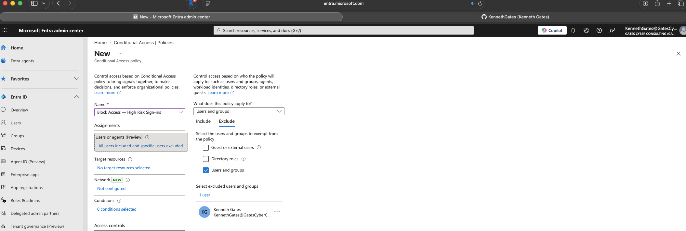

### Step 3: Target Resources — All Resources
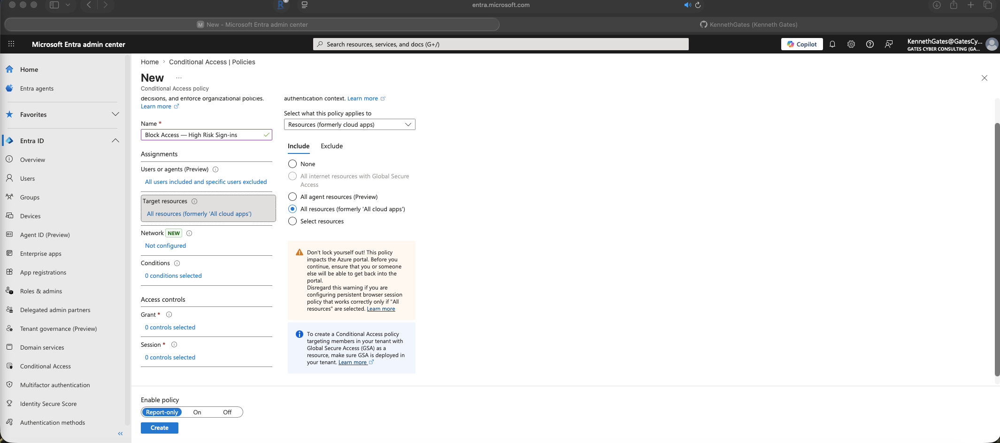

### Step 4: Sign-In Risk — High Only Selected
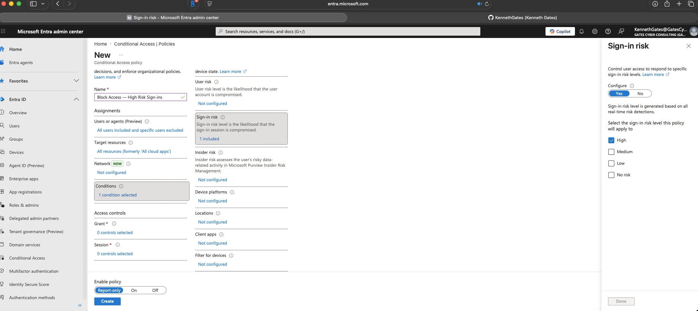

### Step 5: Grant — Block Access Selected
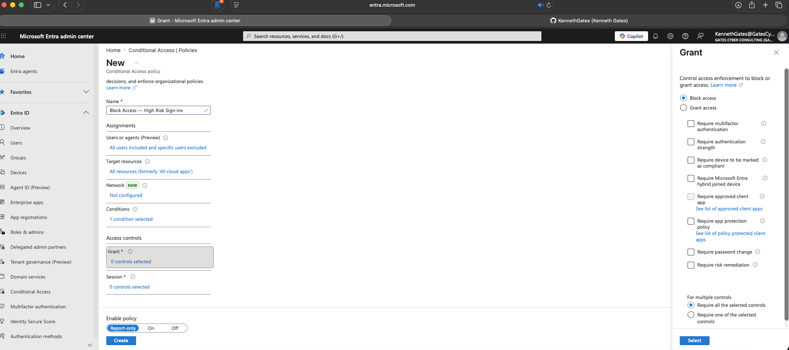

### Final: All 4 Policies — Report-Only Confirmed
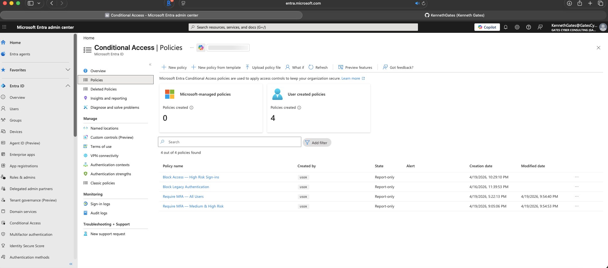

---

## 🔄 Before vs After

**Before:**
- High risk sign-ins were not blocked at the Conditional Access layer
- Even sessions flagged as high risk could proceed with or without MFA
- Threat intelligence signals generated alerts but no enforcement action

**After:**
- High risk sign-ins are blocked entirely before access is granted
- No MFA challenge is offered — access is denied at the policy layer
- Real-time risk intelligence is now directly tied to enforcement

---

## 🔍 Security Impact

Policy 3 challenges medium and high risk sign-ins with MFA. Policy 4 goes further — for the highest risk sessions, MFA is not sufficient. An attacker with access to an MFA device or using a SIM swap attack could still pass an MFA challenge. Blocking access entirely for high risk sign-ins eliminates that gap and ensures that Microsoft's most severe threat detections result in immediate denial rather than a challengeable prompt.

---

### 🧪 Real-World Scenario

A user's credentials appear in a dark web credential dump and are used in a sign-in attempt from a known malicious IP. Entra ID scores this as a high risk sign-in. Policy 3 would challenge with MFA — but if the attacker controls the MFA device, they could pass. Policy 4 blocks the session entirely, ensuring that no level of credential possession grants access when the risk score is at its highest.

---

## 🧠 Key Skills Demonstrated
- Zero Trust Access Enforcement
- Risk-Based Block Policies
- Layered Conditional Access Design
- Microsoft Entra ID Protection
- Threat Intelligence Integration

---

## 👨🏾‍💻 Author
Kenneth Gates
Cybersecurity | IAM | Cloud Security

---

## 🔐 Policy 5 — Require Compliant Device for All Users

### 📌 Overview
This policy requires that all users access cloud resources only from devices marked as compliant in Microsoft Intune. A compliant device has met the organization's security baseline — such as having disk encryption enabled, a PIN set, and up-to-date OS patches.

This moves beyond identity-based controls and adds a device health check as a condition of access, a core pillar of Zero Trust.

---

## ⚙️ Configuration Steps

1. Navigate to **Microsoft Entra ID → Conditional Access**
2. Click **New Policy**
3. Name the policy: `Require Compliant Device — All Users`
4. Set **Users** → All users
   - Exclude: break-glass admin account
5. Set **Target Resources** → All resources
6. Configure **Grant Controls**
   - Select **Grant access**
   - Check **Require device to be marked as compliant**
7. Set policy state to **Report-only**
8. Click **Create**

---

## 📸 Screenshots

### Step 1: Policy Name Entered
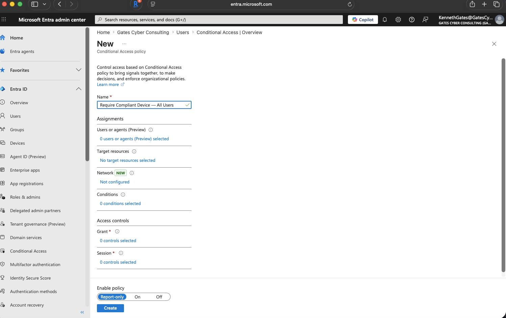

### Step 2: Break-Glass Account Excluded
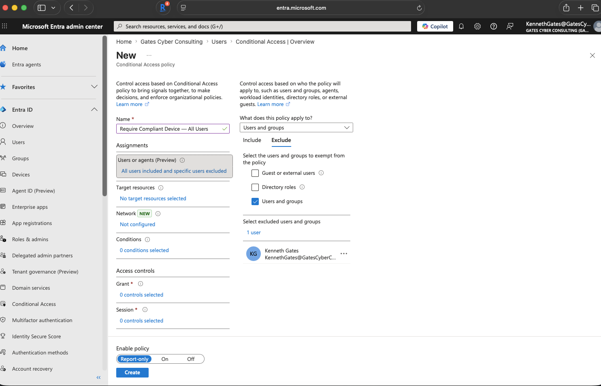

### Step 3: Target Resources — All Resources
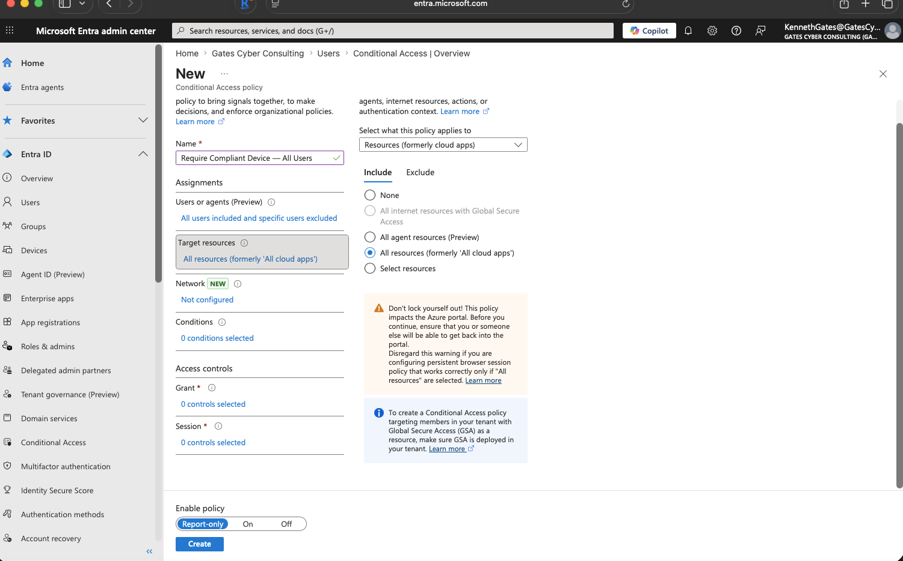

### Step 4: Grant — Require Compliant Device Selected
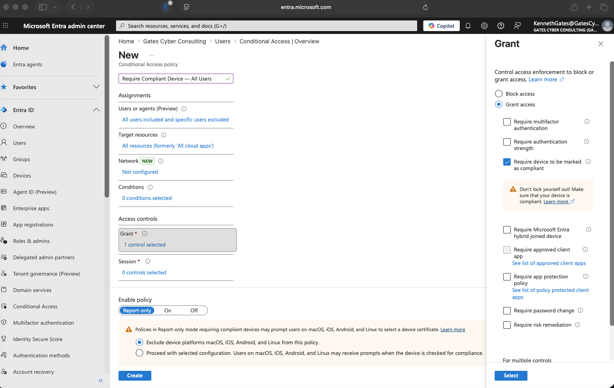

### Step 5: Report-Only Confirmed
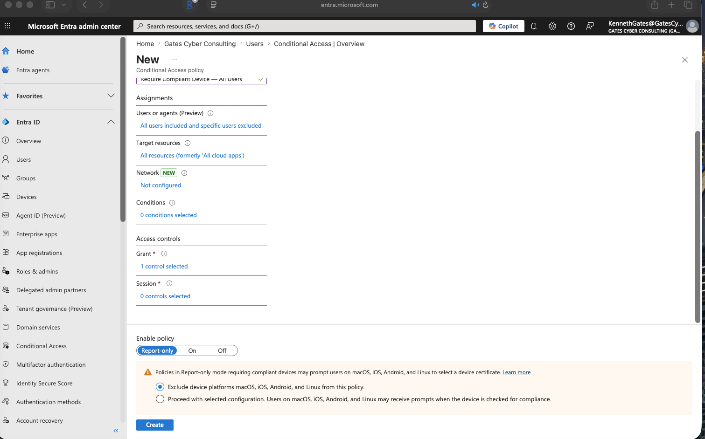

### Final: All 5 Policies — Report-Only Confirmed
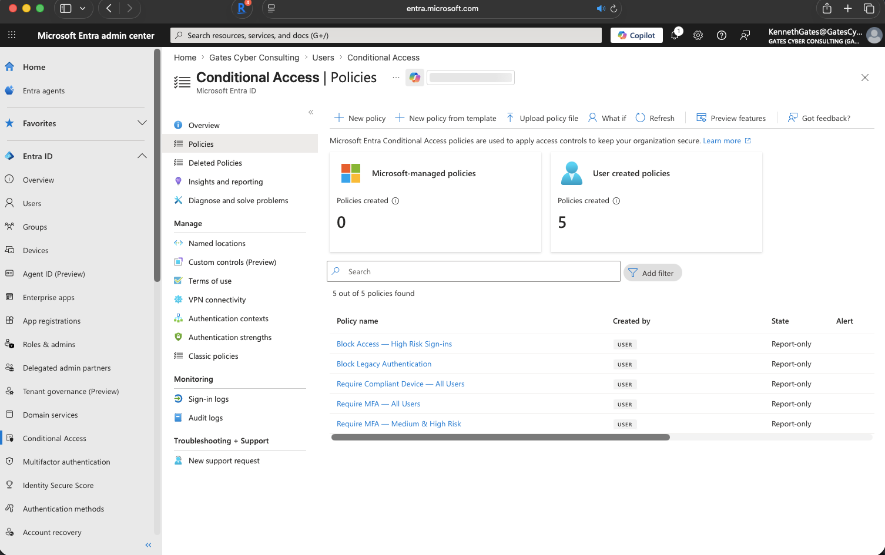

---

## 🔄 Before vs After

**Before:**
- Users could access cloud resources from any device regardless of health
- A compromised or unmanaged device with valid credentials had full access
- No device posture check existed at the access control layer

**After:**
- All users must authenticate from an Intune-compliant device
- Unmanaged, unpatched, or non-enrolled devices are blocked at the CA layer
- Device health is now a required signal alongside identity for access decisions

---

## 🔍 Security Impact

Identity alone is not sufficient to trust a session. A valid username and password from a malware-infected personal device represents a significant risk even if MFA is completed. This policy adds device compliance as a mandatory gate — ensuring that the endpoint itself meets the organization's security baseline before access is granted. Combined with the MFA policies already in place, this creates a strong two-signal requirement: trusted identity AND trusted device.

---

### 🧪 Real-World Scenario

An employee's corporate credentials are used to sign in from a personal laptop that is not enrolled in Intune and has no disk encryption or endpoint protection. Without this policy, the sign-in succeeds. With this policy in place, the device fails the compliance check and access is blocked — even though the credentials and MFA were valid.

---

## 🧠 Key Skills Demonstrated
- Device-Based Conditional Access
- Microsoft Intune Compliance Integration
- Zero Trust Device Posture Enforcement
- Layered Identity and Device Controls
- Report-Only Mode Validation

---

## 👨🏾‍💻 Author
Kenneth Gates
Cybersecurity | IAM | Cloud Security

---

## 🔐 Policy 6 — Require MFA for Admin Roles

### 📌 Overview
This policy applies MFA specifically to users assigned high-privilege directory roles — Global Administrator, Privileged Role Administrator, and Security Administrator. Unlike Policy 2 which enforces MFA for all users, this policy targets the accounts with the highest blast radius if compromised.

Admin accounts are the primary target of advanced persistent threats and credential attacks. This policy ensures they are always subject to MFA regardless of any other policy configuration.

---

## ⚙️ Configuration Steps

1. Navigate to **Microsoft Entra ID → Conditional Access**
2. Click **New Policy**
3. Name the policy: `Require MFA — Admin Roles`
4. Set **Users** → Select users and groups
   - Check **Directory roles**
   - Select:
     - Global Administrator
     - Privileged Role Administrator
     - Security Administrator
5. Set **Target Resources** → All resources
6. Configure **Grant Controls**
   - Select **Grant access**
   - Check **Require multifactor authentication**
7. Set policy state to **Report-only**
8. Click **Create**

---

## 📸 Screenshots

### Step 1: Policy Name Entered
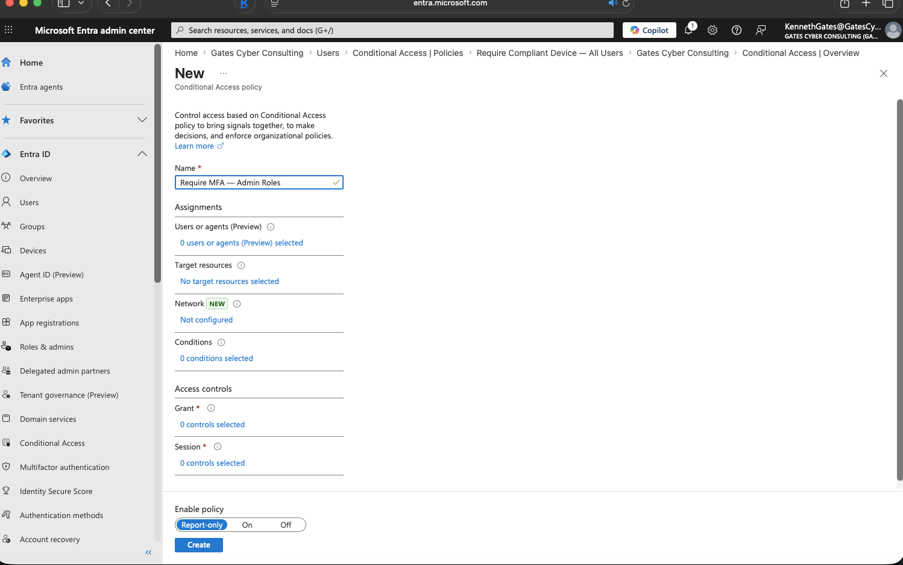

### Step 2a: Directory Roles — Global Administrator Selected
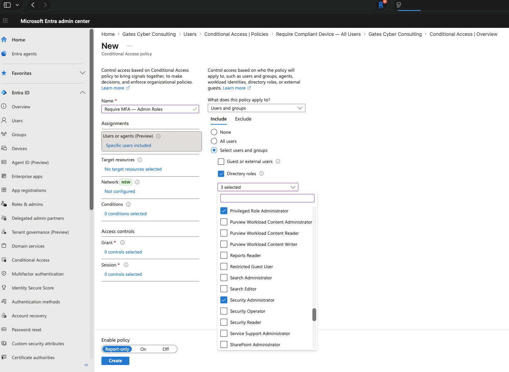

### Step 2b: Directory Roles — Privileged Role Admin + Security Administrator Selected
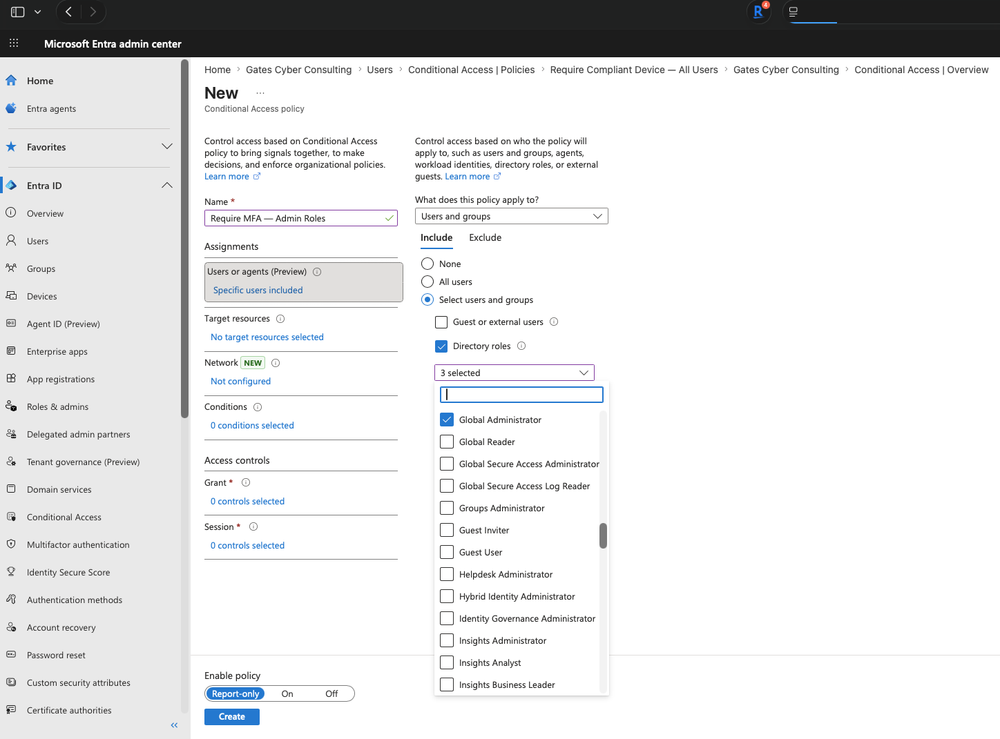

### Step 3: Target Resources — All Resources
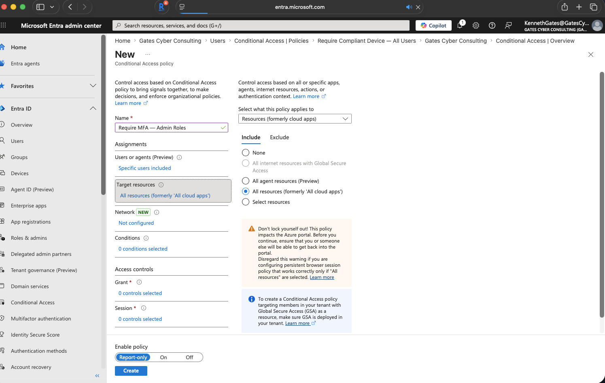

### Step 4: Report-Only Confirmed
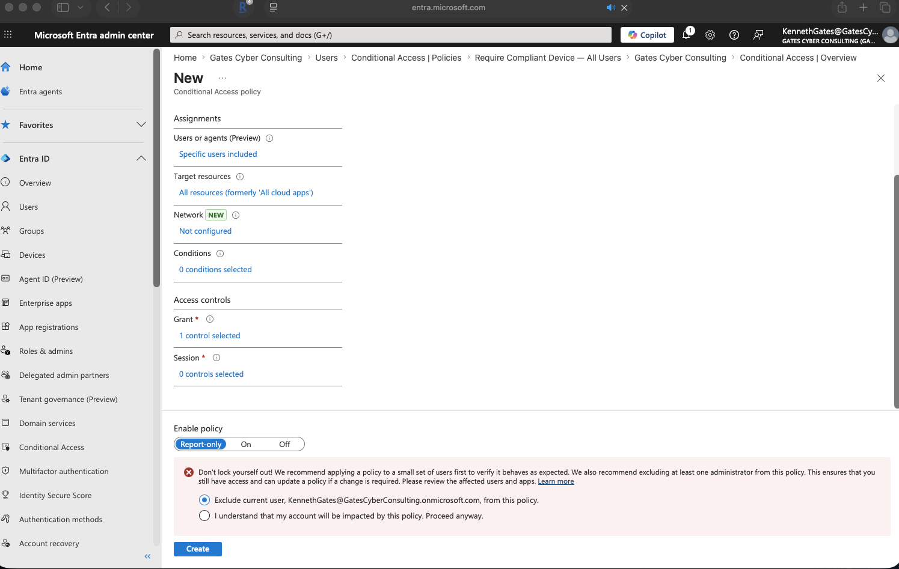

### Final: All 6 Policies — Report-Only Confirmed
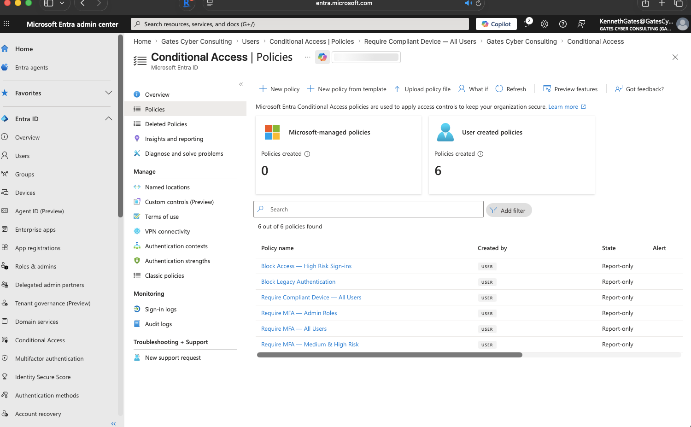

---

## 🔄 Before vs After

**Before:**
- Admin role accounts subject only to the same MFA policies as standard users
- No targeted enforcement existed specifically for privileged identities
- A compromised admin account with no MFA requirement had unrestricted tenant access

**After:**
- Global Administrator, Privileged Role Administrator, and Security Administrator always require MFA
- Privileged identity protection is enforced independently of user-wide policies
- Highest blast-radius accounts have a dedicated, always-on MFA requirement

---

## 🔍 Security Impact

Admin accounts represent the most valuable targets in any tenant. A compromised Global Administrator can create new accounts, modify security policies, disable MFA, and exfiltrate data at scale. Applying a dedicated MFA policy to admin roles ensures that even if the broader MFA policies are misconfigured or temporarily disabled, privileged accounts remain protected by their own enforcement layer.

---

### 🧪 Real-World Scenario

An attacker compromises the password of a Global Administrator account through a phishing campaign. Without this policy, if the admin account had no MFA registered or if a broader policy was misconfigured, the attacker gains full tenant access. With this policy in place, MFA is required at the Conditional Access layer regardless of per-user settings — blocking the attacker even with valid credentials.

---

## 🧠 Key Skills Demonstrated
- Privileged Identity Protection
- Role-Based Conditional Access
- Admin Account Security Hardening
- Microsoft Entra ID Directory Roles
- Zero Trust Privileged Access Design

---

## 👨🏾‍💻 Author
Kenneth Gates
Cybersecurity | IAM | Cloud Security
